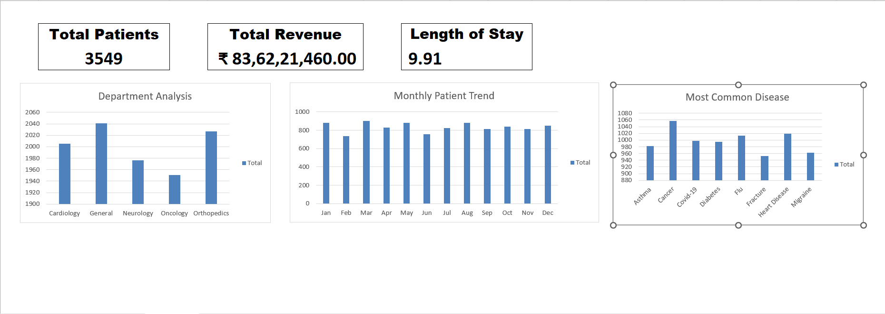

# 🏥 Hospital Patient Dashboard (Excel)

## 📊 Project Overview
This project is an interactive Hospital Patient Dashboard built using Microsoft Excel. It provides insights into patient data, hospital performance, and revenue trends.

---

## 🚀 Key Features
- Total Patients KPI
- Total Revenue Analysis
- Average Length of Stay
- Monthly Patient Trend
- Department-wise Analysis
- Disease Distribution

---

## 🛠️ Tools Used
- Microsoft Excel
- Pivot Tables
- Pivot Charts
- Slicers
- Data Cleaning Techniques

---

## 📸 Dashboard Preview

---

## 📈 Key Insights
- Total Patients: 3549
- Total Revenue: ₹83+ Crores
- Average Length of Stay: 9.9 days
- Peak patient activity observed in mid-year months
- General and Orthopedics departments have highest load

---

## 💡 What I Learned
- Data cleaning and handling missing values
- Creating dynamic dashboards using pivot tables
- Designing KPI cards and visual storytelling

---

## 🔗 Connect With Me
- GitHub: [https://github.com/datawithsiddhesh98](https://github.com/datawithsiddhesh98)
- LinkedIn: [(https://www.linkedin.com/in/siddhesh-mithbavkar/))](https://www.linkedin.com/in/siddhesh-mithbavkar/)

---

⭐ If you like this project, give it a star!
